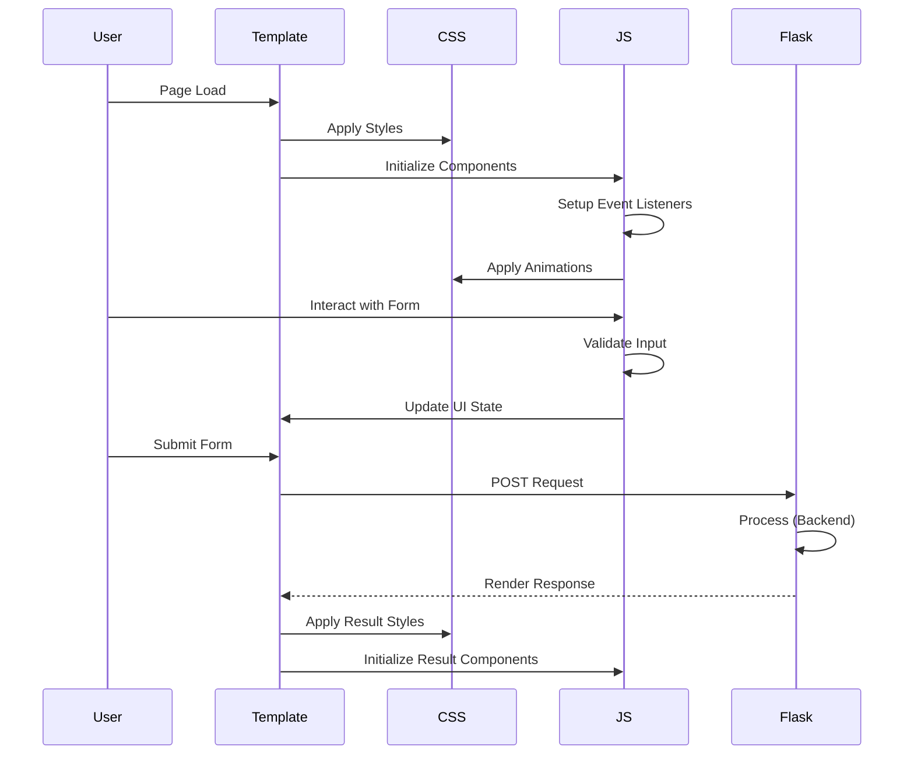

# Design Document: Frontend UI/UX Redesign

## Overview

This design document specifies the complete frontend transformation of the Flask-based RAG Question Paper Generator application from a "college mini project" aesthetic to a professional, portfolio-quality AI learning platform. The redesign focuses exclusively on frontend components—HTML templates, CSS styling, and client-side JavaScript—while preserving all backend functionality including Flask routes, authentication, database operations, and RAG pipeline logic.

The design emphasizes modern UI patterns (glassmorphism, neumorphism, gradient accents), smooth animations, responsive layouts, and professional component architecture using vanilla JavaScript, CSS3, and the existing Flask+Jinja2 template structure.

## Architecture

### High-Level Component Structure

```mermaid
graph TB
    subgraph "Frontend Layer"
    \
    hu=
        Templates[Jinja2 Templates]
        CSS[CSS Architecture]
        JS[JavaScript Modules]
        Assets[Static Assets]
    end
    
    subgraph "Template Structure"
        BaseAuth[fullpage_base.html]
        BaseDash[dashboard_base.html]
        Login[login.html]
        Register[register.html]
        Dashboard[index.html]
        Papers[papers.html]
        Competitive[competitive.html]
        Tutor[tutor.html]
        Revision[revision.html]
        FullTest[fulltest.html]
        Analyzer[chapter_analyzer.html]
        Results[result.html]
    end
    
    subgraph "CSS Modules"
        Variables[CSS Variables]
        BaseStyles[Base Styles]
        ComponentStyles[Component Styles]
        UtilityClasses[Utility Classes]
        Animations[Animation Library]
    end
    
    subgraph "JavaScript Modules"
        ThemeManager[Theme Manager]
        FormValidator[Form Validator]
        Animations_JS[Animation Controller]
        ChartManager[Chart Manager]
        UIComponents[UI Components]
    end
    
    Templates --> BaseAuth
    Templates --> BaseDash
    BaseDash --> Dashboard
    BaseDash --> Papers
    BaseDash --> Competitive
    BaseDash --> Tutor
    BaseDash --> Revision
    BaseDash --> FullTest
    BaseDash --> Analyzer
    BaseAuth --> Results
    
    CSS --> Variables
    CSS --> BaseStyles
    CSS --> ComponentStyles
    CSS --> UtilityClasses
    CSS --> Animations
    
    JS --> ThemeManager
    JS --> FormValidator
    JS --> Animations_JS
    JS --> ChartManager
    JS --> UIComponents
```

### Component Interaction Flow



## Design System

### Color Palette

**Primary Palette:**
```css
--primary: #2563EB;        /* Blue - Primary actions */
--primary-hover: #1D4ED8;  /* Blue hover state */
--primary-light: #DBEAFE;  /* Blue background tint */

--secondary: #6366F1;      /* Indigo - Secondary actions */
--secondary-hover: #4F46E5;
--secondary-light: #E0E7FF;

--accent: #6C63FF;         /* Purple - Accents & highlights */
--accent2: #A855F7;        /* Purple variant */
--accent3: #06B6D4;        /* Cyan - Info elements */
